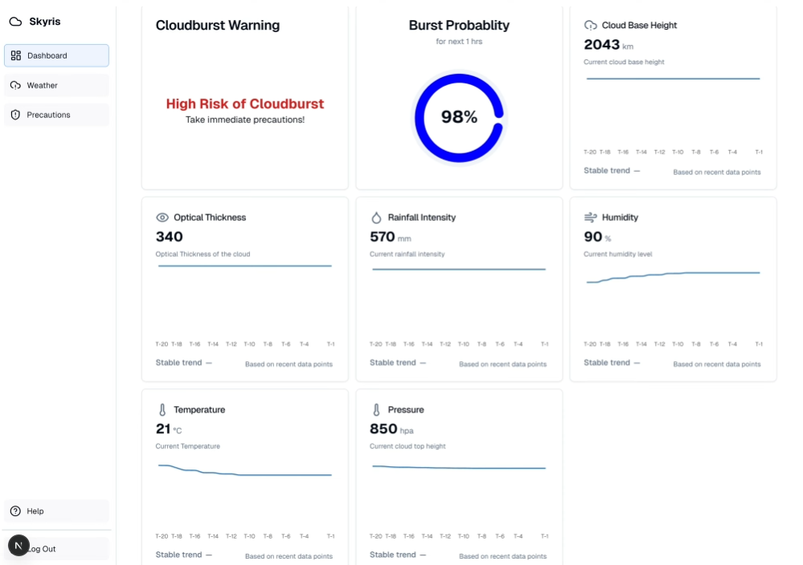
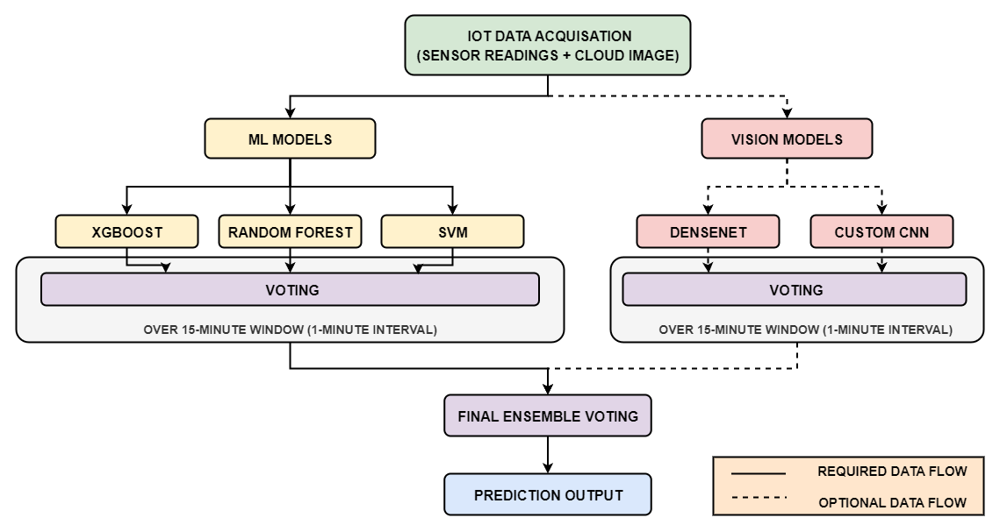
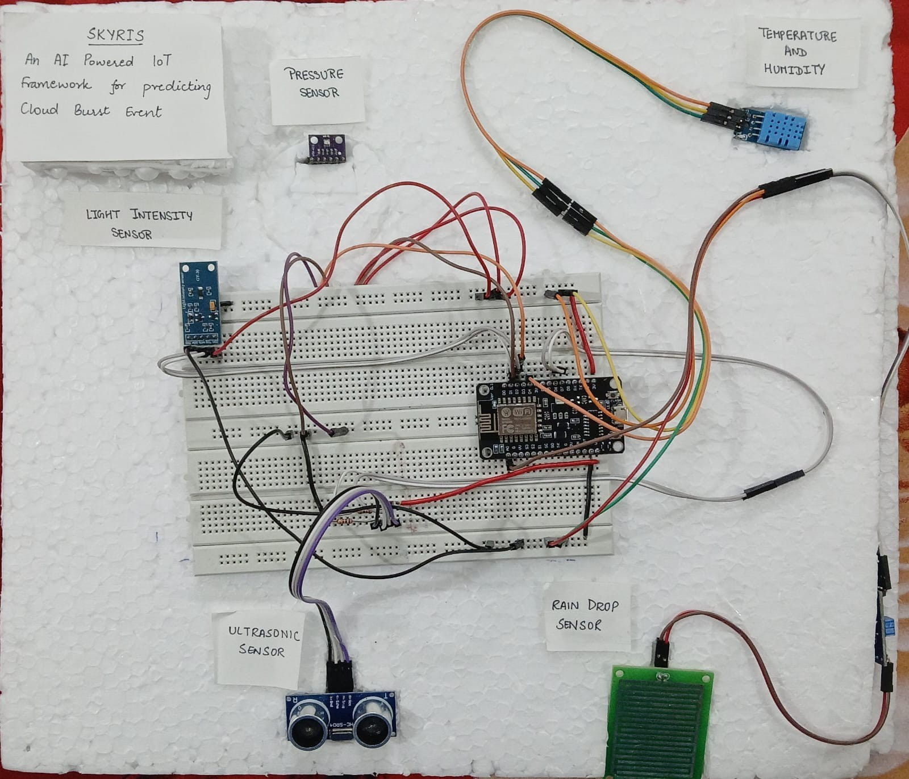

<div align="center">

# ☁️ Skyris — IoT + ML Cloudburst Prediction System

**Real-time cloudburst prediction powered by IoT sensor networks and ensemble machine learning**


</div>

---

## 📑 Table of Contents

- [Overview](#-overview)
- [Screenshots](#-screenshots)
- [System Architecture](#-system-architecture)
- [IoT Hardware & Sensors](#-iot-hardware--sensors)
- [ML Models & Pipeline](#-ml-models--pipeline)
- [Tech Stack](#-tech-stack)
- [Project Structure](#-project-structure)
- [Prerequisites](#-prerequisites)
- [Environment Variables Setup](#-environment-variables-setup)
- [Installation & Setup](#-installation--setup)
- [Running the Project](#-running-the-project)
- [API Endpoints](#-api-endpoints)
- [Dataset](#-dataset)
- [How It Works](#-how-it-works)
- [Dashboard Features](#-dashboard-features)
---

## 🌐 Overview

**Skyris** is an end-to-end IoT + Machine Learning framework for **real-time cloudburst prediction and early warning**. The system combines a network of environmental sensors deployed on an ESP8266 microcontroller with an ensemble of tabular and vision-based ML models served via a FastAPI backend, all visualized through a modern Next.js web dashboard.

Cloudbursts — sudden, intense rainfall events — are responsible for devastating flash floods, landslides, and loss of life, particularly in mountainous regions. Skyris addresses this by:

1. **Collecting real-time atmospheric data** from IoT sensors (temperature, humidity, pressure, rainfall intensity, light/optical thickness, distance/cloud base height).
2. **Feeding sensor data into an ensemble of ML models** (XGBoost, Random Forest, SVM) for tabular prediction, alongside CNN and DenseNet vision models for cloud imagery analysis.
3. **Generating a consensus prediction** using majority voting across all models with rolling-window aggregation.
4. **Displaying live predictions, sensor readings, and weather data** on an interactive dashboard with real-time charts, maps, and alert systems.

---

## 📸 Screenshots

### Dashboard — Live Prediction Interface


### ML Backend Architecture


### IoT Hardware Prototype


---

## 🏗 System Architecture

```
┌──────────────────────────────────────────────────────────────────────┐
│                        SKYRIS ARCHITECTURE                          │
├──────────────────────────────────────────────────────────────────────┤
│                                                                      │
│  ┌─────────────┐     Serial/USB      ┌──────────────────────┐       │
│  │  ESP8266     │ ──────────────────► │  Python Serial       │       │
│  │  + Sensors   │    CSV Data         │  Bridge (api.py)     │       │
│  │  (IoT Node)  │                     └─────────┬────────────┘       │
│  └─────────────┘                                │                    │
│                                                  │ HTTP POST          │
│  ┌─────────────┐     HTTP POST                  ▼                    │
│  │  Camera      │ ─────────────► ┌──────────────────────────┐        │
│  │  Module      │   /image/      │   FastAPI ML Server      │        │
│  └─────────────┘                 │   (server.py)            │        │
│                                  │                          │        │
│                                  │  ┌────────────────────┐  │        │
│                                  │  │ Tabular Models     │  │        │
│                                  │  │  • XGBoost         │  │        │
│                                  │  │  • Random Forest   │  │        │
│                                  │  │  • SVM (SVC)       │  │        │
│                                  │  └────────────────────┘  │        │
│                                  │  ┌────────────────────┐  │        │
│                                  │  │ Vision Models      │  │        │
│                                  │  │  • CNN             │  │        │
│                                  │  │  • DenseNet        │  │        │
│                                  │  └────────────────────┘  │        │
│                                  │                          │        │
│                                  │  Rolling Window (5)      │        │
│                                  │  Majority Voting         │        │
│                                  └────────────┬─────────────┘        │
│                                               │                      │
│                                               │ GET /latest-result/  │
│                                               ▼                      │
│                                  ┌──────────────────────────┐        │
│                                  │   Next.js 15 Frontend    │        │
│                                  │   (React 19 + TypeScript)│        │
│                                  │                          │        │
│                                  │  • Real-time Dashboard   │        │
│                                  │  • Sensor Charts         │        │
│                                  │  • Weather Integration   │        │
│                                  │  • Interactive Map       │        │
│                                  │  • Alert System          │        │
│                                  └────────────┬─────────────┘        │
│                                               │                      │
│                                               ▼                      │
│                                  ┌──────────────────────────┐        │
│                                  │   Supabase               │        │
│                                  │  • Auth (Email/Password) │        │
│                                  │  • PostgreSQL (Users)    │        │
│                                  └──────────────────────────┘        │
└──────────────────────────────────────────────────────────────────────┘
```

---

## 🔌 IoT Hardware & Sensors

### Microcontroller

| Component | Specification |
|-----------|--------------|
| **Board** | ESP8266 (NodeMCU / Wemos D1 Mini) |
| **Clock** | 80 MHz / 160 MHz |
| **Flash** | 4 MB |
| **Communication** | USB Serial @ 115200 baud |
| **I2C Pins** | D2 (SDA), D1 (SCL) |

### Sensor Array

| Sensor | Model | Measures | Interface | Pin(s) | Output Range |
|--------|-------|----------|-----------|--------|-------------|
| **Temperature & Humidity** | DHT11 | Temperature (°C), Relative Humidity (%) | Digital (One-Wire) | D4 (GPIO2) | Temp: 0–50°C, Humidity: 20–90% |
| **Barometric Pressure** | BMP280 | Atmospheric Pressure (hPa) | I2C (0x76) | D2/D1 | 300–1100 hPa |
| **Light Intensity** | BH1750 | Illuminance / Optical Thickness (lux) | I2C (0x23 or 0x5C) | D2/D1 | 1–65535 lux |
| **Rain Sensor** | YL-83 / FC-37 | Rainfall Intensity (analog) | Analog | A0 | 0–1024 (inverted) |
| **Ultrasonic Distance** | HC-SR04 | Cloud Base Height approximation (cm) | Digital (Trigger/Echo) | D6 (Trig), D7 (Echo) | 2–400 cm |


### Data Output Format (CSV over Serial)

The Arduino firmware transmits sensor readings every **5 seconds** as CSV:

```
Cloud_Top_Height, Cloud_Base_Height, Optical_Thickness, Rainfall, Humidity, Temperature, Pressure
```

- **Cloud_Top_Height**: Encoded binary flag (0 or 1) based on rainfall intensity threshold (>100 → 1).
- **Cloud_Base_Height**: Ultrasonic distance measurement (cm).
- **Optical_Thickness**: Light level from BH1750 (lux, used as optical thickness approximation).
- **Rainfall**: Inverted analog rain sensor value (1024 - raw).
- **Humidity**: DHT11 humidity reading (%).
- **Temperature**: DHT11 temperature reading (°C).
- **Pressure**: BMP280 pressure reading (hPa).

---

## 🧠 ML Models & Pipeline

### Tabular Models (Numerical Sensor Data)

Trained on a **10,000-record cloudburst dataset** with 7 features and binary classification.

| Model | File | Type | Description |
|-------|------|------|-------------|
| **XGBoost** | `xgboost_model.pkl` | Gradient Boosting | High-accuracy ensemble tree model |
| **Random Forest** | `random_forest_model.pkl` | Bagging Ensemble | Robust multi-tree classifier |
| **SVM (SVC)** | `svc_model.pkl` | Support Vector | Kernel-based binary classifier |
| **Logistic Regression** | `logistic_regression_model.pkl` | Linear | Baseline probabilistic classifier |

### Vision Models (Cloud Imagery)

| Model | File | Architecture | Input Size | Description |
|-------|------|-------------|------------|-------------|
| **CNN** | `cnn_binary_classification_model.keras` | Custom CNN | 128×128 RGB | Binary cloud classification |
| **DenseNet** | `DenseNet_model.keras` | DenseNet Transfer Learning | 128×128 RGB | Dense connectivity pattern for feature reuse |

### Ensemble Prediction Pipeline

```
Sensor Data (every 5s)
        │
        ▼
┌──────────────────────┐
│ StandardScaler       │  (Fitted on training data)
│ Transform features   │
└──────────┬───────────┘
           │
     ┌─────┼─────┐
     ▼     ▼     ▼
  XGBoost  RF   SVC        ← Predict class + probability
     │     │     │
     └─────┼─────┘
           │
           ▼
  Rolling Window (size=5)   ← Aggregate last 5 predictions
           │
           ├──────────────── Vision Models (CNN + DenseNet)
           │                 (if image received in window)
           ▼
  Majority Voting            ← All model votes combined
           │
           ▼
  Final Prediction           ← Class (0/1) + Probability
```

- **Rolling Window**: Aggregates 5 consecutive predictions before computing final result.
- **Majority Voting**: Tabular model votes + vision model votes → majority decides final class.
- **Probability**: Average of per-model cloudburst probabilities (class 1) across the window.

### Training Notebooks

| Notebook | Location |
|----------|----------|
| XGBoost Classifier | `ml_backend/num_model/notebooks/XGBoostClassifier.ipynb` |
| Random Forest Classifier | `ml_backend/num_model/notebooks/RandomForestClassifier.ipynb` |
| SVM (SVC) Classifier | `ml_backend/num_model/notebooks/SupportVectorClassifier.ipynb` |
| Logistic Regression | `ml_backend/num_model/notebooks/Logistic_Regression.ipynb` |
| CNN Binary Classification | `ml_backend/vision_model/notebooks/CNN.ipynb` |
| DenseNet Transfer Learning | `ml_backend/vision_model/notebooks/DenseNet.ipynb` |

---

## 🛠 Tech Stack

### Frontend

| Technology | Version | Purpose |
|-----------|---------|---------|
| **Next.js** | 15 (Turbopack) | React framework with SSR/SSG |
| **React** | 19 | UI component library |
| **TypeScript** | 5 | Type-safe development |
| **Tailwind CSS** | 3.4 | Utility-first CSS framework |
| **Shadcn/ui** | Latest (New York) | Accessible component library (Radix UI primitives) |
| **Framer Motion** | 12 | Animations and transitions |
| **Recharts** | 2.15 | Data visualization / charts |
| **React Leaflet** | 5 | Interactive maps |
| **TanStack React Query** | 5 | Server state management & caching |
| **next-themes** | 0.4 | Dark/light mode support |
| **Lucide React** | 0.544 | Icon library |

### Backend (ML Server)

| Technology | Purpose |
|-----------|---------|
| **FastAPI** | High-performance REST API framework |
| **Uvicorn** | ASGI server |
| **scikit-learn** | StandardScaler, SVC, Random Forest, train/test split |
| **XGBoost** | Gradient boosting classifier |
| **TensorFlow / Keras** | CNN and DenseNet vision models |
| **Joblib** | Model serialization |
| **Pandas / NumPy** | Data manipulation |
| **Pillow** | Image preprocessing |

### Authentication & Database

| Technology | Purpose |
|-----------|---------|
| **Supabase Auth** | Email/password authentication with PKCE flow |
| **Supabase PostgreSQL** | User profile storage |
| **Supabase SSR** | Server-side auth session management |

### IoT / Embedded

| Technology | Purpose |
|-----------|---------|
| **Arduino IDE** | Firmware development for ESP8266 |
| **ESP8266 (NodeMCU)** | Microcontroller with WiFi |
| **PySerial** | Serial communication bridge (Arduino → Python) |

### Package Manager

| Tool | Purpose |
|------|---------|
| **Bun** | JavaScript runtime & package manager (primary) |
| **pip** | Python package manager |

---

## 📁 Project Structure

```
cloud-burst-prediction/
│
├── app/                            # Next.js App Router
│   ├── layout.tsx                  # Root layout (ThemeProvider, Supabase, Auth)
│   ├── page.tsx                    # Landing page (Hero, Features, Working, Contact)
│   ├── globals.css                 # Global styles
│   ├── auth/                       # Authentication routes
│   │   ├── login/page.tsx          # Login page
│   │   ├── signup/page.tsx         # Sign-up page
│   │   ├── forgot-password/page.tsx
│   │   ├── update-password/page.tsx
│   │   ├── sign-up-success/page.tsx
│   │   ├── confirm/route.ts        # Email confirmation handler
│   │   └── error/page.tsx
│   └── protected/                  # Auth-gated routes
│       ├── layout.tsx              # Dashboard layout (Sidebar, Providers)
│       └── page.tsx                # Protected page (redirects if not logged in)
│
├── components/
│   ├── home/                       # Landing page sections
│   │   ├── Hero.tsx                # Hero section with animated CTA
│   │   ├── Features.tsx            # Feature highlights
│   │   ├── Working.tsx             # "How It Works" stepper
│   │   ├── Contact.tsx             # Contact section
│   │   ├── Footer.tsx              # Footer
│   │   ├── GlobalBG.tsx            # Animated background
│   │   └── Navbar.tsx              # Navigation bar
│   │
│   ├── auth/                       # Authentication components
│   │   ├── login-form.tsx          # Login form with Supabase
│   │   ├── sign-up-form.tsx        # Multi-step sign-up with password strength
│   │   ├── forgot-password-form.tsx
│   │   ├── update-password-form.tsx
│   │   └── logoutbtn.tsx
│   │
│   ├── protected/                  # Dashboard components
│   │   ├── AppSidebar.tsx          # Collapsible sidebar navigation
│   │   ├── Dashboard.tsx           # Main dashboard with live sensor cards
│   │   ├── Weather.tsx             # OpenWeatherMap integration (472 lines)
│   │   ├── Page1.tsx               # Cloudburst precautions & emergency info
│   │   ├── ProtectedContent.tsx    # Dynamic page renderer
│   │   ├── Help.tsx                # Help page
│   │   └── dashboard/             # Dashboard sub-components
│   │       ├── CloudburstProbability.tsx   # Radial probability chart
│   │       ├── KpiCards.tsx               # Key metric cards
│   │       ├── MapWidget.tsx              # Leaflet interactive map
│   │       ├── RainfallLineChart.tsx      # Rainfall trend chart
│   │       ├── HourlyForecastBar.tsx      # Hourly forecast
│   │       ├── WindHumidity.tsx           # Wind & humidity display
│   │       ├── RecentAlerts.tsx           # Alert history
│   │       ├── RiskByZone.tsx             # Zone-based risk assessment
│   │       ├── CloudburstInfo.tsx         # Cloudburst info panel
│   │       └── cards/                     # Reusable chart cards
│   │           ├── LineChartCard.tsx
│   │           ├── RadialChart.tsx
│   │           └── ...
│   │
│   ├── providers/                  # React context providers
│   │   ├── AuthProvider.tsx        # Authentication state
│   │   ├── NavigationContext.tsx    # SPA-style page navigation
│   │   └── SupabaseProvider.tsx    # Supabase client provider
│   │
│   └── ui/                         # Shadcn/ui components
│       ├── accordion.tsx, button.tsx, card.tsx, chart.tsx, ...
│       └── (20+ reusable UI primitives)
│
├── contexts/
│   └── PredictionDataContext.tsx    # Global prediction data state (polling + history)
│
├── hooks/
│   ├── useOpenWeatherMap.ts        # OpenWeatherMap API integration (5-min refresh)
│   ├── usePredictionData.ts        # ML prediction data fetcher (5s polling)
│   ├── usePersistentPredictionData.ts  # Prediction data with localStorage history
│   ├── useDatabase.ts             # Supabase DB queries (TanStack Query)
│   ├── useUserProfile.ts          # Auth user state management
│   └── use-mobile.tsx             # Mobile responsive detection
│
├── lib/
│   ├── utils.ts                   # Utility functions (cn, hasEnvVars)
│   └── supabase/
│       ├── client.ts              # Browser Supabase client (PKCE)
│       ├── server.ts              # Server Supabase client
│       └── middleware.ts          # Auth middleware for protected routes
│
├── ml_backend/                    # Python ML Server
│   ├── server.py                  # FastAPI server (260 lines)
│   ├── click_image.py             # Camera capture utility
│   ├── num_model/
│   │   ├── data/
│   │   │   ├── cloudburst_dataset.csv          # 10,000 records
│   │   │   └── cloudburst_dataset_documentation.md
│   │   ├── models/
│   │   │   ├── xgboost_model.pkl
│   │   │   ├── random_forest_model.pkl
│   │   │   ├── svc_model.pkl
│   │   │   └── logistic_regression_model.pkl
│   │   └── notebooks/             # Training notebooks
│   │       ├── XGBoostClassifier.ipynb
│   │       ├── RandomForestClassifier.ipynb
│   │       ├── SupportVectorClassifier.ipynb
│   │       └── Logistic_Regression.ipynb
│   └── vision_model/
│       ├── data/
│       │   └── cloud_dataset/     # Cloud images (0/ non-cloudburst, 1/ cloudburst)
│       ├── models/
│       │   ├── cnn_binary_classification_model.keras
│       │   └── DenseNet_model.keras
│       └── notebooks/
│           ├── CNN.ipynb
│           └── DenseNet.ipynb
│
├── Arduino Ide code/              # IoT Firmware & Bridge
│   ├── blinkesp2_copy_20250913083518/
│   │   └── blinkesp2_copy_20250913083518.ino  # ESP8266 sensor firmware
│   └── api.py                     # Serial-to-HTTP bridge script
│
├── supabase/
│   ├── config.toml                # Supabase project config
│   └── migrations/
│       └── 20250903000000_create_users_table.sql  # Users table + trigger
│
├── assets/                        # Documentation images
│   ├── dashboard.png
│   ├── MLBackend.png
│   └── prototype.jpg
│
├── middleware.ts                   # Next.js route middleware
├── package.json                   # Frontend dependencies
├── requirements.txt               # Python ML dependencies
├── tailwind.config.ts
├── tsconfig.json
├── next.config.ts
├── postcss.config.mjs
├── eslint.config.mjs
└── components.json                # Shadcn/ui configuration
```

---

## ✅ Prerequisites

Ensure the following are installed on your system:

| Requirement | Version | Purpose |
|------------|---------|---------|
| **Node.js** | 18+ | JavaScript runtime |
| **Bun** | Latest | Package manager & runtime (preferred) |
| **Python** | 3.10+ | ML backend server |
| **pip** | Latest | Python package manager |
| **Arduino IDE** | 2.x | Firmware upload to ESP8266 |
| **Git** | Latest | Version control |

### Hardware Requirements (for IoT deployment)

- ESP8266 NodeMCU or Wemos D1 Mini
- DHT11 Temperature & Humidity Sensor
- BMP280 Barometric Pressure Sensor
- BH1750 Light Intensity Sensor
- YL-83 / FC-37 Rain Sensor Module
- HC-SR04 Ultrasonic Distance Sensor
- USB Cable (Micro-USB for ESP8266)
- Breadboard & jumper wires
- (Optional) USB Camera for cloud image capture

---

## 🔐 Environment Variables Setup

Create a `.env.local` file in the **project root** directory:

```env
# ──────────────────────────────────────────────
# Supabase Configuration (Required)
# ──────────────────────────────────────────────
# Get these from: https://app.supabase.com → Project Settings → API
NEXT_PUBLIC_SUPABASE_URL=https://your-project-id.supabase.co
NEXT_PUBLIC_SUPABASE_ANON_KEY=your_supabase_anon_key_here

# ──────────────────────────────────────────────
# OpenWeatherMap API (Required for Weather page)
# ──────────────────────────────────────────────
# Get a free API key from: https://openweathermap.org/api
NEXT_PUBLIC_OPENWEATHER_API_KEY=your_openweathermap_api_key_here

# ──────────────────────────────────────────────
# ML Backend Server URL (Optional — defaults shown)
# ──────────────────────────────────────────────
# The FastAPI ML server URL where predictions are fetched from.
# Update this if your ML server runs on a different host/port.
# For local development: http://localhost:8000
```

### Supabase Setup

1. Create a project at [supabase.com](https://supabase.com).
2. Go to **Project Settings → API** and copy:
   - **Project URL** → `NEXT_PUBLIC_SUPABASE_URL`
   - **anon public key** → `NEXT_PUBLIC_SUPABASE_ANON_KEY`
3. Run the migration to create the users table. In the Supabase SQL Editor, execute:

   ```sql
   create table public.users (
     id uuid not null primary key references auth.users(id) on delete cascade,
     created_at timestamptz not null default now(),
     email varchar(255),
     phone varchar(255),
     name varchar(255)
   );

   create or replace function public.handle_new_user()
   returns trigger as $$
   begin
     insert into public.users (id, email, phone, name)
     values (
       new.id,
       new.email,
       coalesce(new.raw_user_meta_data->>'phone', ''),
       coalesce(new.raw_user_meta_data->>'name', '')
     );
     return new;
   end;
   $$ language plpgsql security definer;

   create trigger on_auth_user_created
     after insert on auth.users
     for each row execute procedure public.handle_new_user();
   ```

4. Enable **Email Auth** in Supabase → Authentication → Providers.

---

## 🚀 Installation & Setup

### 1. Clone the Repository

```bash
git clone https://github.com/PrakharSinghOnGit/cloud-burst-prediction.git
cd cloud-burst-prediction
```

### 2. Install Frontend Dependencies

```bash
bun install
```

> Or with npm: `npm install`

### 3. Install Python ML Dependencies

```bash
pip install -r requirements.txt
```

Required Python packages:
```
tqdm
numpy
pandas
matplotlib
fastapi
pydantic
uvicorn
joblib
xgboost
scikit-learn
tensorflow
python-multipart
python-dotenv
```

### 4. Arduino Firmware Setup (IoT Node)

1. Open `Arduino Ide code/blinkesp2_copy_20250913083518/blinkesp2_copy_20250913083518.ino` in **Arduino IDE**.
2. Install required Arduino libraries via Library Manager:
   - `DHT sensor library` (by Adafruit)
   - `Adafruit BMP280 Library`
   - `Adafruit Unified Sensor`
   - `BH1750` (by Christopher Laws)
3. Select Board: **NodeMCU 1.0 (ESP-12E Module)** or your ESP8266 variant.
4. Select the correct **COM port**.
5. Upload the firmware.

### 5. Configure Serial Bridge

Edit `Arduino Ide code/api.py`:
- Update the **serial port** (`COM5` on Windows, `/dev/ttyUSB0` on Linux).
- Update the **API endpoint URL** to your ML server address.

```python
arduino = serial.Serial('/dev/ttyUSB0', 115200)  # Adjust port
url = "http://localhost:8000/data"                 # Adjust URL
```

---

## ▶️ Running the Project

### Step 1: Start the ML Backend Server

```bash
cd ml_backend
uvicorn server:app --host 0.0.0.0 --port 8000 --reload
```

The FastAPI server will:
- Load the cloudburst dataset and fit the StandardScaler.
- Load all tabular models (XGBoost, Random Forest, SVC).
- Load vision models (CNN, DenseNet).
- Serve prediction endpoints on `http://localhost:8000`.

### Step 2: Start the Frontend

```bash
# From the project root
bun run dev
```

The Next.js app starts on `http://localhost:3000` with Turbopack.

### Step 3: Start the IoT Data Pipeline (Optional — requires hardware)

```bash
cd "Arduino Ide code"
python api.py
```

This reads sensor data from the ESP8266 over serial and POSTs it to the ML server every 5 seconds.

### Step 4: Cloud Image Capture (Optional)

```bash
cd ml_backend
python click_image.py
```

Press **SPACE** to capture a snapshot, which can be sent to the `/image/` endpoint.

---

## 📡 API Endpoints

The FastAPI ML server exposes the following endpoints:

| Method | Endpoint | Description |
|--------|----------|-------------|
| `POST` | `/data/` | Submit sensor data array for prediction |
| `POST` | `/image/` | Upload a cloud image for vision model prediction |
| `GET` | `/latest-result/` | Get the latest prediction result with model details |

### POST `/data/`

**Request Body:**
```json
{
  "data": [1, 45.2, 320.5, 512, 87.3, 22.1, 950.4]
}
```

Fields (in order): `[cloud_top, distance, light, rain, humidity, temperature, pressure]`

**Response:**
```json
{
  "current_prediction": {
    "xgboost_tabular": 1,
    "rf_tabular": 1,
    "svc_tabular": 0
  },
  "current_prediction_prob": {
    "xgboost_tabular": 0.87,
    "rf_tabular": 0.92,
    "svc_tabular": 0.43
  },
  "final_prediction": 1,
  "final_prediction_prob": 0.74,
  "window_status": {
    "current_size": 3,
    "needed_for_final": 2
  },
  "last_input": [15000, 45.2, 320.5, 512, 87.3, 22.1, 950.4],
  "image_status": "not received"
}
```

### POST `/image/`

**Request:** Multipart form data with image file.

**Response:**
```json
{
  "status": "success",
  "predictions": {
    "cnn1": { "predicted_class": 1, "probability": 0.89 },
    "cnn2": { "predicted_class": 1, "probability": 0.76 }
  },
  "message": "Image predictions stored for current window"
}
```

### GET `/latest-result/`

Returns the most recent prediction state with all model outputs, sensor readings, and window status.

---

## 📊 Dataset

The system is trained on a **10,000-record cloudburst prediction dataset** with the following composition:

| Source Type | Records | Cloudburst Rate | Description |
|-------------|--------:|----------------:|-------------|
| Actual-based | 160 | 97.5% | Real historical event variations |
| Extreme Synthetic | 1,500 | 99.1% | Severe cloudburst conditions |
| Moderate Synthetic | 1,500 | 99.1% | Moderate cloudburst conditions |
| Marginal Synthetic | 3,500 | 53.7% | Borderline conditions |
| Normal Synthetic | 3,340 | 10.4% | Typical weather scenarios |
| **Total** | **10,000** | **53.5%** | **Balanced classification** |

### Feature Ranges

| Feature | Unit | Min | Max | Mean |
|---------|------|-----|-----|------|
| Cloud Top Height | meters | 10,559 | 19,490 | 15,130 |
| Cloud Base Height | meters | 784 | 6,132 | 2,294 |
| Optical Thickness | dimensionless | 13.9 | 104.9 | 57.2 |
| Rainfall | mm/hour | 113.9 | 639.3 | 230.4 |
| Humidity | % | 63.0 | 102.5 | 82.8 |
| Temperature | °C | 2.5 | 43.8 | 20.6 |
| Pressure | hPa | 800.7 | 1026.7 | 931.4 |

### Historical Events in Dataset

The dataset incorporates real-world cloudburst events including:
- **Kedarnath Disaster** (2013) — 326 mm rainfall, Uttarakhand, India
- **Mumbai Floods** (2005) — 944 mm rainfall, Mumbai, India
- **Ahr Valley Floods** (2021) — 150 mm/18hr, Germany
- **HP Solan** (2023) — 273 mm rainfall, Himachal Pradesh, India
- And 4 more documented events

---

## ⚙️ How It Works

### 1. Data Collection (IoT Layer)
The ESP8266 microcontroller reads data from all 5 sensors every 5 seconds, formats it as CSV, and transmits it over USB serial.

### 2. Data Ingestion (Bridge Layer)
The Python serial bridge (`api.py`) reads CSV lines from the Arduino, parses and validates them, then sends the data as JSON to the FastAPI ML server via HTTP POST.

### 3. Prediction (ML Layer)
The FastAPI server:
- Scales incoming features using a pre-fitted `StandardScaler`.
- Runs data through **3 tabular models** (XGBoost, Random Forest, SVC) to get class predictions and probabilities.
- If a cloud image is received, runs it through **2 vision models** (CNN, DenseNet).
- Maintains a **rolling window of 5 predictions** per model.
- When the window is full, performs **majority voting** across all model votes to produce a final consensus prediction and an averaged probability.

### 4. Visualization (Frontend Layer)
The Next.js dashboard:
- **Polls the ML server every 5 seconds** for the latest prediction via `GET /latest-result/`.
- Displays real-time line charts for each sensor reading (Cloud Base Height, Optical Thickness, Rainfall, Humidity, Temperature, Pressure).
- Shows a **radial probability gauge** for cloudburst risk level.
- Provides a **cloudburst warning banner** (Low / Medium / High risk).
- Integrates **OpenWeatherMap** for current weather conditions at the user's geolocation.
- Renders an **interactive Leaflet map** showing the user's location and risk zones.
- Includes a **Precautions page** with emergency contacts, do's and don'ts, FAQs, and resources.

### 5. Authentication (Security Layer)
- Supabase Auth with email/password (PKCE flow).
- Protected routes enforced via Next.js middleware.
- User profiles stored in Supabase PostgreSQL with automatic creation on sign-up (database trigger).

---

## 📋 Dashboard Features

| Feature | Description |
|---------|-------------|
| **Cloudburst Warning Card** | Risk-level display (Low/Medium/High) with contextual messaging |
| **Radial Probability Gauge** | Visual consensus probability across all models |
| **Sensor Line Charts** | Real-time charts for each of 6 sensor readings with history |
| **Model Probabilities** | Per-model prediction breakdown (XGBoost, RF, SVM) |
| **Interactive Map** | Leaflet map with user location, city center, and risk circles |
| **Weather Dashboard** | Full OpenWeatherMap integration (temp, wind, humidity, visibility, sunrise/sunset) |
| **Precautions Page** | Before/During/After cloudburst guidelines, emergency contacts, FAQs |
| **Dark/Light Mode** | Theme switching with `next-themes` |
| **Responsive Design** | Mobile-first with collapsible sidebar |
| **Live Status Indicator** | Green/red connection status dot with manual refresh |

---